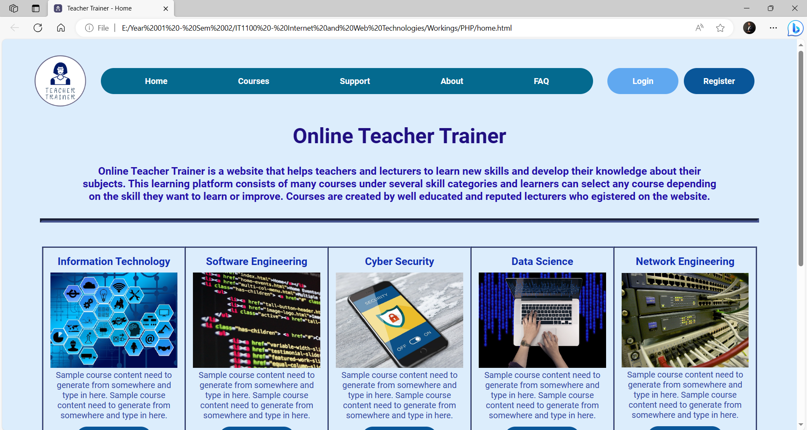
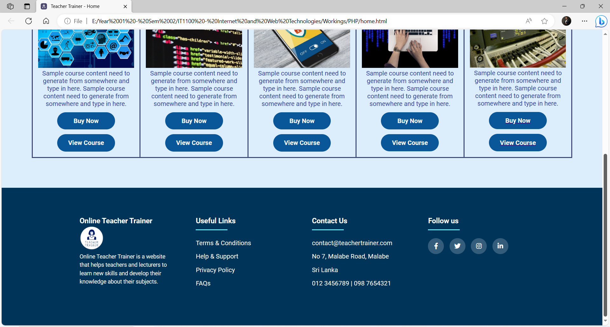

# Online Teacher Trainer
A comprehensive web-based learning platform designed specifically for teachers and lecturers to enhance their subject matter expertise and pedagogical skills through professional development courses.

---
## Features

### User Roles & Dashboards
The platform provides role-based access with specialized dashboards for each user type:

**Learner (Teacher/Lecturer)**
- Register and browse available courses
- Purchase educational content
- Improve classroom management and digital literacy skills

**Lecturer (Course Creator)**
- Access dedicated Lecturer Dashboard
- Create and manage courses
- Upload documents and videos
- Send announcements to enrolled learners

**Support Agent**
- Manage help requests and technical issues
- Provide assistance to users
- Handle password reset requests

**Administrator**
- Oversee entire platform operations
- Manage all user types and permissions
- Evaluate and approve new lecturer registrations

---

## Core Functionalities

### Course Management
Browse and explore courses with detailed information including topics, pricing, and comprehensive descriptions before making a purchase decision.

### Shopping Cart & Payments
- Add multiple courses to cart
- Secure checkout process with "Pay Now" functionality
- Multiple payment method support

### Support System
Dedicated Help & Support portal where users can:
- Submit support requests
- Attach relevant documents
- Resolve technical issues efficiently

### Announcement System
Broadcast important updates and information from both Administrators and Lecturers directly to learners.

---

## Tech Stack

| Component | Technology |
|-----------|------------|
| **Frontend** | HTML5, CSS3, JavaScript |
| **Backend** | PHP |
| **Database** | MySQL |

---

## Security Features

- **Password Encryption**: User credentials are securely hashed and never stored in plain text
- **Session Management**: Secure session handling to maintain login states and protect sensitive pages
- **Role-Based Access Control (RBAC)**: Users are automatically redirected to authorized dashboards based on their assigned role

---

## Project Structure

```
online-teacher-trainer/
│
├── index.php                              # Home page with course categories
├── learner_registration.php               # OTP-verified registration for learners
├── login.php                              # Unified login portal for all roles
├── courses.php                            # Browsable course catalog
├── cart.php                               # Shopping cart and checkout
├── user_profile.php                       # User dashboard and profile management
│
└── dashboards/
    ├── lecturer_dashboard.php             # Course content management tools
    ├── sup_agnt_dashboard.php             # Support ticket and password reset management
    └── admin_dashboard.php                # Platform oversight and user management
```





---


---

## Development Team

| Team Member | Responsibilities |
|-------------|------------------|
| **R. M. S. D. Rathnayake** | Support Agent Functionality & Home Page |
| **N. N. Siriwardana** | Course Purchase System & Login Flow |
| **H. P. D. D. Premathilaka** | User Profile & Lecturer Dashboard |
| **Y. L. Jayasinghe** | Admin Dashboard & Site Policies |
| **W. G. A. Dilshan** | Learner Registration & FAQ/About Pages |
